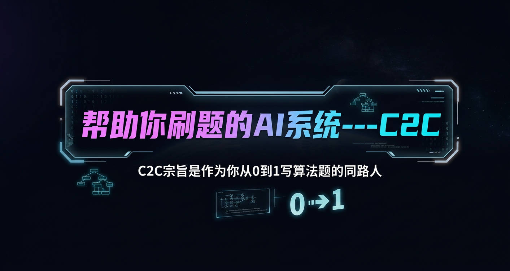
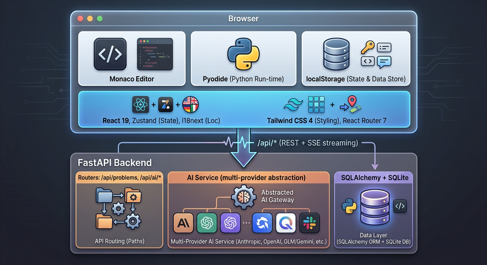

# C2C — Coding to Creating

> AI 驱动的开源编程教学平台 · BYOK（用自己的 LLM API Key）· 完全免费

<p align="center">
  
</p>

<p align="center">
  <strong>不只是刷题——真正学会编程。</strong><br/>
  从读懂题目到写出代码，像一位耐心的老师陪在你身边，逐步引导。
</p>

<p align="center">
  <a href="LICENSE"></a>
  
  
  
</p>

[中文](#三步上手) | [English](#why-c2c)

---

## 三步上手

C2C 是开源项目，**不收费、不消耗你的钱**——你用自己申请的 LLM API Key（Anthropic / OpenAI / 通义 / 豆包 / GLM / Gemini 任选其一）。

### 方式 1：下载桌面版（推荐 · 零依赖）

去 [Releases](https://github.com/Charlies2001/C2C-coding-coach/releases) 下载对应平台的包：

| 平台 | 文件 | 怎么用 |
|------|------|--------|
| macOS (Apple Silicon) | `CodingBot-macos-arm64.zip` | 解压拖到「应用程序」，首次启动右键→打开 |
| Windows (x64) | `CodingBot-windows-x64.zip` | 解压双击 `CodingBot.exe`，SmartScreen 提示点「更多信息→仍要运行」 |
| Linux (x64) | `CodingBot-linux-x64.tar.gz` | `tar xzf` 后 `./CodingBot/CodingBot` |

启动后会自动打开浏览器，左上角会出现一个 C2C 系统托盘图标——这是 app 在运行的标志，**关闭浏览器标签后请通过托盘菜单退出**，否则后台还在跑。

> ⚠️ 因为没买代码签名证书，首次启动系统会警告「未知开发者」。这是开源软件的常态，需要你手动放行一次。

### 方式 2：Docker 一行命令（自己跑后端）

```bash
git clone https://github.com/Charlies2001/C2C-coding-coach.git
cd C2C-coding-coach
cp backend/.env.example backend/.env
docker compose up -d
open http://localhost:3001
```

### 方式 3：本地开发（贡献代码用）

见 [本地开发](#本地开发不用-docker)。

部署到云服务器对外服务参考 [`docs/DEPLOYMENT.md`](docs/DEPLOYMENT.md)。

---

## 设计初衷

大多数编程平台给你一道题和一个编辑器——然后你就得靠自己了。

C2C 不一样。它的核心理念是**「教会你」而不是「替你做」**：

- **卡住了？** AI 不会直接给答案。它会反问你、引导你的思路、只透露刚好够你继续前进的信息。
- **不知道从哪开始？** 教学模式把每道题拆成 6–8 个章节——语法、数据结构、解题思路、逐步实现——每一章都是根据当前题目实时生成的。
- **代码报错了？** 平台自动识别错误类型，映射到对应的教学章节，一键跳转复习。
- **准备代码面试？** C2C 同样适合正在备战技术面试的同学。通过分章节教学和渐进式提示，帮助你系统性地掌握算法思路和解题模式，而不是死记硬背答案，真正提高学习效率。

C2C 是为**想真正学会编程**的人设计的——无论你是编程初学者，还是正在准备面试的求职者。

---

## 核心功能

### AI 分章节教学

每道题生成定制化多章节课程：

| 章节 | 内容 |
|------|------|
| 读懂代码 | 函数签名、参数、返回值、调用示例 |
| 必备语法 | 仅讲解本题需要的 Python 语法，配最小化示例 |
| 核心数据结构 | 生活类比 → Mermaid 图解 → Python 操作 |
| 解题思路 | 纯文字描述算法逻辑，配合测试用例手动模拟 |
| 逐步实现 | 3–5 个递进步骤，每步都有代码 + 「为什么这样写」 |
| 总结回顾 | 知识清单、核心能力、相似题目方向 |
| 动手实战 | 3–5 个递进小任务，内嵌编辑器，由易到难 |
| 常见错误 *(仅困难)* | ❌ 错误写法 vs ✅ 正确写法对比 |

- 章节数量随难度调整：简单(6)、中等(7)、困难(8)
- 每章感知上下文——AI 阅读所有之前的章节，避免重复
- 包含交互式 Mermaid 算法图解

### 4 级渐进式提示

绝不直接给答案——逐步引导：

| 级别 | 名称 | 你会得到 |
|------|------|---------|
| 1 | 方向引导 | 启发性问题，指向正确方向 |
| 2 | 算法策略 | 具体的数据结构/算法建议 |
| 3 | 伪代码框架 | 逐步逻辑框架 |
| 4 | 关键代码 | 关键代码片段（仍不是完整答案） |

- AI 分析你的当前代码，判断应该给哪一级提示
- 连续 3 次测试失败后自动弹出「需要提示吗？」

### AI 苏格拉底式对话

能看到你的题目、代码、输出和测试结果的对话式导师：

- 通过提问引导，绝不直接给答案
- 帮助调试时追踪执行过程，而不是重写你的代码
- 每道题独立保存对话历史——随时继续
- 快捷键 `⌘L` / `Ctrl+L` 切换

### 浏览器内 Python 运行

- 基于 [Pyodide](https://pyodide.org/)——Python 完全在浏览器中运行
- 零配置，无需服务端执行，即时反馈
- **运行**模式：执行代码，查看 stdout/stderr
- **提交**模式：运行全部测试用例（每题 18–22 个），查看通过/失败明细
- 10 秒超时 + 死循环检测

### 智能错误检测

代码报错时，C2C 不只是显示堆栈信息：

- 提取错误类型（`SyntaxError`、`IndexError`、`RecursionError` 等）
- 映射到最相关的教学章节
- 显示横幅：*「遇到 SyntaxError → 复习『必备语法』章节」*
- 一键跳转到对应章节

### AI 出题

用自然语言创建自定义题目：

- 用一句话描述题目 → AI 生成完整结构
- 输出：标题、难度、分类、描述（Markdown）、代码模板、18–22 个测试用例
- 测试用例覆盖：基础、常规、边界、极端、陷阱场景
- 根据当前 UI 语言生成对应语言的题目
- 保存前可编辑所有内容

### 个性化教学

告诉 AI 你的情况，它会据此调整：

| 维度 | 选项 |
|------|------|
| 编程经验 | 零基础 / 初学者 / 有一定基础 / 熟练 |
| 学习目标 | 面试准备 / 课程作业 / 兴趣爱好 / 技能提升 |
| 学习方式 | 手把手教 / 先讲原理 / 先试后学 / 看例子学 |
| 教学风格 | 专业严谨 / 轻松有趣 / 温暖鼓励 |

64 种组合——每种都会改变 AI 的讲解方式、重点和语气。

### 收藏夹 & 成长树

- 星标收藏题目
- 将题目整理到命名收藏夹中
- 按收藏夹筛选题目列表
- 创建、重命名、删除收藏夹
- 成长可视化：**种子 → 发芽 → 幼苗 → 小树 → 大树 → 开花**
- 每题记录解题状态，按难度统计

### 多语言支持

- **界面**：中文（默认）、英文、日文、韩文——设置中即时切换
- **种子题目**：10 道经典题目翻译为 4 种语言
- **AI 出题**：根据当前 UI 语言生成
- **AI 教学/提示/对话**：自动使用你正在使用的语言

### 多 LLM 供应商支持

| 供应商 | 默认模型 | 备注 |
|--------|---------|------|
| Anthropic | claude-sonnet-4-6 | 原生 SDK |
| OpenAI | gpt-4o | |
| Google Gemini | gemini-2.0-flash | 通过 OpenAI 兼容 API |
| 阿里通义千问 | qwen-plus | 通过 OpenAI 兼容 API |
| 字节豆包 | doubao-1.5-pro-32k | 通过 OpenAI 兼容 API |
| 智谱 GLM | glm-4-flash | 通过 OpenAI 兼容 API |

在 UI 中配置——无需环境变量。API Key 存储在浏览器 localStorage 中。

---

## 系统架构

<p align="center">
  
</p>

### 关键设计决策

**SSE 流式传输** — 所有 AI 端点使用 Server-Sent Events。比 WebSocket 简单，能穿透代理，实现教学、提示和对话的逐 token 实时渲染。

**浏览器内 Python 执行** — Pyodide 让 Python 完全在浏览器中运行。无需服务端执行代码，无安全风险，无需沙箱，即时反馈。

**供应商抽象** — Anthropic 使用原生 SDK；其他所有供应商通过 OpenAI SDK + 自定义 `base_url` 路由。新增供应商只需在注册表中加一条记录。

**按题目 localStorage 持久化** — 对话历史、提示、教学内容和代码全部按题目存储在 localStorage 中。无需认证，离线可用，数据保持私密。

**章节 key 系统** — 教学章节内部使用英文 key（`readCode`、`syntax`、`approach`...），显示时通过 i18n 翻译，与后端通信时使用中文标题。前端保持整洁的同时兼容后端。

---

## 本地开发（不用 Docker）

### 前置要求

- Node.js ≥ 20
- Python ≥ 3.12
- 任一支持的 LLM 供应商的 API Key

### 安装 + 启动

```bash
# 后端（终端 1）
cd backend
cp .env.example .env
pip install -r requirements.txt
uvicorn app.main:app --reload --port 8000

# 前端（终端 2）
cd frontend
npm install
npm run dev
```

打开 http://localhost:5173 → 注册账号 → **设置**（齿轮图标）→ 填 API Key → 开始学习。

### 生产部署

公网上线（HTTPS + 外部 PostgreSQL + 结构化日志）请参考 [`docs/DEPLOYMENT.md`](docs/DEPLOYMENT.md)。

---

## 配置

### UI 设置

所有主要配置都在 UI 的**设置弹窗**中完成：

| 设置项 | 说明 |
|--------|------|
| **LLM 供应商** | Anthropic、OpenAI、Gemini、通义千问、豆包、GLM |
| **API Key** | 供应商的 API Key（登录后保存到后端数据库，Fernet 对称加密） |
| **模型** | 可选覆盖（留空使用供应商默认模型） |
| **语言** | 界面语言：中文 / English / 日本語 / 한국어 |

### 环境变量（可选）

在 `backend/.env` 中设置：

| 变量 | 默认值 | 说明 |
|------|--------|------|
| `DATABASE_URL` | `sqlite:///./coding_bot.db` | 数据库连接串（生产用 `postgresql://...`） |
| `SEED_LANGUAGE` | `zh-CN` | 首次启动时种子题目的语言（`zh-CN`、`en-US`、`ja-JP`、`ko-KR`） |
| `ANTHROPIC_API_KEY` | — | 备用 API Key（用户配置优先） |
| `JWT_SECRET_KEY` | 启动自动生成 | JWT 签名密钥（生产必须固定） |
| `ENCRYPTION_KEY` | 复用 JWT_SECRET | API Key Fernet 加密密钥（生产建议独立） |
| `CORS_ORIGINS` | `localhost:3000,3001,5173` | 允许的前端源（生产填实际域名） |
| `LOG_FORMAT` | `json` | `json`（生产）或 `text`（开发可读） |
| `LOG_DIR` | — | 设置后日志写到该目录（RotatingFileHandler 10MB × 5） |

---

## 技术栈

| 层级 | 技术 |
|------|------|
| 前端 | React 19, TypeScript, Vite 7, Tailwind CSS 4, Zustand, Monaco Editor, React Router 7 |
| 后端 | Python 3.12, FastAPI, SQLAlchemy, SQLite |
| AI | Anthropic SDK, OpenAI SDK（多供应商） |
| 代码运行时 | Pyodide 0.27（浏览器内 Python） |
| 图表 | Mermaid.js（教学内容中） |
| 国际化 | i18next + react-i18next |
| 部署 | Docker + Nginx |

## 项目结构

```
C2C/
├── frontend/                     # React SPA
│   ├── src/
│   │   ├── pages/                # LandingPage, ProblemListPage, ProblemPage
│   │   ├── components/
│   │   │   ├── TeachingMode/     # Blackboard, CodeBlock, GuidedCoding, MiniCodeEditor
│   │   │   ├── ProblemWorkspace/ # OutputPanel, HintPanel, ErrorJumpBanner
│   │   │   ├── ProblemList/      # ProblemCard, ProblemFilters, CollectionFilterChips
│   │   │   ├── AIChat/           # AIChatPanel
│   │   │   └── GrowthTree/      # GrowthTree, StatsPanel, TreeSVG
│   │   ├── api/                  # REST + SSE streaming clients
│   │   ├── i18n/locales/         # zh-CN, en-US, ja-JP, ko-KR
│   │   ├── services/             # Pyodide integration
│   │   ├── store/                # Zustand state (per-problem persistence)
│   │   └── utils/                # Section titles, error mapping
│   ├── Dockerfile
│   └── nginx.conf
├── backend/
│   ├── app/
│   │   ├── main.py               # App entry, auto-migration, seed logic
│   │   ├── config.py             # Environment settings
│   │   ├── database.py           # SQLAlchemy engine
│   │   ├── models/               # Problem model
│   │   ├── routers/
│   │   │   ├── problems.py       # CRUD endpoints
│   │   │   └── ai.py             # Streaming AI endpoints
│   │   ├── services/
│   │   │   └── ai_service.py     # Multi-provider AI, prompt engineering
│   │   └── seed/                 # 10 problems × 4 languages
│   ├── requirements.txt
│   └── Dockerfile
├── docker-compose.yml
├── LICENSE                       # MIT
└── README.md
```

## API 参考

### 题目

| 方法 | 端点 | 说明 |
|------|------|------|
| `GET` | `/api/problems` | 题目列表（可选 `?difficulty=&category=`） |
| `GET` | `/api/problems/:id` | 获取单个题目 |
| `POST` | `/api/problems` | 创建题目 |
| `DELETE` | `/api/problems/:id` | 删除题目 |

### AI（全部通过 SSE 流式传输）

| 方法 | 端点 | 说明 |
|------|------|------|
| `POST` | `/api/ai/chat` | 苏格拉底式对话辅导 |
| `POST` | `/api/ai/hint` | 渐进式提示（自动判断级别） |
| `POST` | `/api/ai/teaching-section` | 生成单个教学章节 |
| `POST` | `/api/ai/generate-problem` | 根据描述生成题目 |
| `GET` | `/api/ai/teaching-sections/:difficulty` | 获取对应难度的章节标题列表 |
| `GET` | `/api/health` | 健康检查 |

---

## 开源协议

[MIT](LICENSE)

---

## English

### Why C2C?

Most coding platforms give you a problem and an editor — you're on your own. C2C takes a different approach:

- **You're stuck?** The AI doesn't hand you the answer. It asks you questions, nudges your thinking, and reveals just enough to keep you moving.
- **You don't know where to start?** Teaching Mode breaks the problem down into chapters — syntax, data structures, approach, implementation — each generated specifically for the problem you're working on.
- **You made an error?** The platform detects the error type, maps it to the relevant teaching chapter, and offers a one-click jump to review.
- **Preparing for coding interviews?** C2C is also designed for students preparing for technical interviews. Through chapter-based teaching and progressive hints, it helps you systematically master algorithmic thinking and problem-solving patterns — improving study efficiency instead of rote memorization.

C2C is built for people who want to **learn**, not just copy solutions — whether you're a beginner or preparing for your next job interview.

### Features

**AI Chapter-by-Chapter Teaching** — Each problem gets a custom, multi-chapter lesson (6–8 chapters) with syntax explanation, Mermaid algorithm diagrams, step-by-step implementation, and hands-on practice.

**4-Level Progressive Hints** — Direction → Algorithm Strategy → Pseudocode → Key Code. AI analyzes your current code to determine the right hint level.

**AI Chat Tutor (Socratic Method)** — Sees your problem, code, and output. Guides through questioning, never dumps the answer.

**In-Browser Python Execution** — Powered by Pyodide, zero setup. Run mode for output, Submit mode for all test cases (18–22 per problem).

**Smart Error Detection** — Auto-detects `SyntaxError`, `IndexError`, etc., maps to teaching chapters, one-click jump to review.

**AI Problem Generation** — Describe a problem in one sentence → AI generates full structure (title, description, starter code, test cases). Supports generation in the current UI language.

**Personalization** — 4 dimensions (experience, goal, learning style, teaching tone), 64 combinations. AI adapts accordingly.

**Collections & Growth Tree** — Bookmark management, difficulty stats, growth visualization (Seed → Flowering Tree).

**Multi-Language** — UI supports Chinese/English/Japanese/Korean with instant switching.

**Multi-LLM Support** — Anthropic, OpenAI, Gemini, Qwen, Doubao, GLM — configure in the UI.

### Quick Start

```bash
git clone https://github.com/Charlies2001/C2C.git
cd C2C

# Backend
cd backend
cp .env.example .env
pip install -r requirements.txt
uvicorn app.main:app --reload

# Frontend (new terminal)
cd frontend
npm install
npm run dev
```

Open http://localhost:5173 → click **Settings** (gear icon) → select provider → enter API key → start learning.

### Docker (Recommended)

> Requires [Docker Desktop](https://www.docker.com/products/docker-desktop/) (Mac/Windows) or [Docker Engine](https://docs.docker.com/engine/install/) (Linux).

```bash
cp backend/.env.example backend/.env
docker compose up --build
```

Open http://localhost:3000. No Node.js or Python installation needed.
